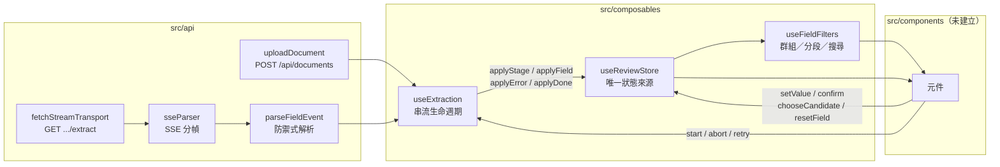
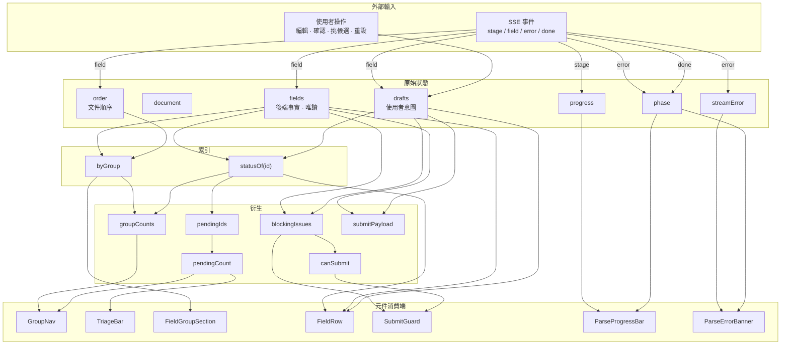

# 應用程式結構

這份文件說明 `frontend/` 的檔案配置、資料流向，以及每一塊存在的理由

建議的閱讀順序：先看「狀態機」知道整個流程長什麼樣，再看「資料流」知道誰寫誰讀，最後才看個別檔案

---

## 目前的實作範圍

| 層                                      | 狀態                                                                             |
| --------------------------------------- | -------------------------------------------------------------------------------- |
| 型別（`src/types/`）                    | ✅ 已建立                                                                        |
| 傳輸層（`src/api/`）                    | ✅ 已建立，`fetch` ＋ `ReadableStream`                                           |
| 狀態與 composable（`src/composables/`） | ✅ 已建立                                                                        |
| 測試                                    | ✅ 45 支，涵蓋 SSE 分幀、HTTP 狀態分流、分組順序、送出阻擋、中止、中途失敗、重設 |
| 元件（`src/components/`）               | ⬜ 尚未拆分，本文件的「元件配置」章節是規劃                                      |

`src/App.vue` 已把上傳與串流顯示接起來，但刻意停在**原生 HTML 元素、零樣式**的狀態：
這個階段要驗證的是資料有沒有正確地邊串邊進畫面，不是版面。編輯、確認、挑候選、送出
都還沒接上（store 已經有這些動作），元件拆分與切版一併留到下一階段

同理，`src/style.css` 暫時把 `@import 'tailwindcss'` 註解掉 —— preflight 會把 table
框線與標題級距歸零，在還沒有任何 class 的情況下只會讓資料更難讀

---

## 狀態機

整個 app 是單一文件的單一流程，畫面切換全部由 `phase` 決定

```
idle ──start()──▶ uploading ──上傳成功──▶ parsing ──done──▶ review ──送出──▶ submitted
                     │                      │
                     └──上傳失敗───────┐     ├── error 事件 ──▶ failed
                                      └─────┴── abort()     ──▶ aborted
```

三個判斷寫在這裡，因為它們決定了後面所有的結構：

**一、`parsing` 與 `review` 不是兩個畫面**

SSE 一送來 `field` 事件就進清單，使用者可以立刻開始審。若做成「解析中畫面 → 轉場 → 審核畫面」，就等於讓使用者盯著空白畫面數十秒，直接違反題目第一條需求

**二、`failed` 與 `aborted` 都不是死路**

兩者都保留已經抽到的欄位，差別只在原因與可用的動作。`failed` 提供「重新解析」，`aborted` 提供「繼續等」的反悔路徑。清空欄位回到 `idle` 會讓使用者前面等的幾十秒全部作廢

**三、重新解析不重新上傳**

`document_id` 還在，重傳檔案只是讓使用者多等一次。所以 `uploadDocument` 與 extract 是兩支獨立的函式，而不是一支 `uploadAndExtract`

---

## 資料流



元件永遠不直接碰 `fetch`，也不直接碰串流。傳輸層是一個可注入的介面（`ExtractionTransport`），測試塞假的進去就能推事件，不需要真的後端，也不需要等真的時間

這個介面先後被 `EventSource` 與 `fetchStreamTransport` 兩種實作填過（見決策 08），換掉傳輸方式時 store、composable、既有測試一行都不用改

---

## 檔案配置

### `src/types/field.ts` — 領域型別與唯一的狀態判準

| 匯出                       | 目的                                            |
| -------------------------- | ----------------------------------------------- |
| `ExtractedField`           | 後端說的事實，收到之後永遠不再變動              |
| `FieldDraft`               | 使用者的意圖：`value` / `confirmed` / `touched` |
| `FieldStatus`              | 一列的四種狀態，決定色條顏色                    |
| `resolveStatus()`          | **全專案唯一的狀態判準**                        |
| `LOW_CONFIDENCE_THRESHOLD` | 低把握度的界線，0.7                             |
| `groupOrder()`             | 群組顯示順序，未知群組排在已知的四個之後        |

**為什麼 `ExtractedField` 與 `FieldDraft` 要分開**

合成同一個物件的話，「重設」無法實作 —— 原值已經被蓋掉了。而且分不出「使用者主動確認過」與「系統把握度高所以不用管」，這兩件事在需求裡是不同語意

**為什麼狀態判準只能有一份**

色條、待處理計數、群組角標、篩選條件全部從 `resolveStatus()` 衍生。散到各元件裡就會出現「側欄說 5 個、清單只有 4 條有色」這種對不起來的情況。閾值要調也只改一個地方

**判斷優先序**：`missing` ＞ `multiCandidate` ＞ `lowConfidence` ＞ `ok`

多候選排在低把握之前，是因為候選是「要你挑一個」，動作比「去看一眼」明確。後端給多候選時一定同時給低把握度，兩者永遠同時成立

**`0.7` 這個數字的來源**：mock 後端產生的 `confidence` 是雙峰的 —— 低的落在 0.31～0.68，高的落在 0.82～0.99，中間是空的。0.7 落在縫隙裡，怎麼調都不會改變分類結果。真實後端未必如此分布，這是本專案最沒把握的數字，詳見文末

**非必填又沒抽到的欄位不標色**：使用者無從得知文件裡到底有沒有這個值，標了只是製造一堆他沒辦法處理的紅點

---

### `src/types/extraction.ts` — 流程型別與傳輸層介面

定義四種 SSE 事件（`stage` / `field` / `error` / `done`）、`ReviewPhase`、`ExtractOptions`，以及最重要的 `ExtractionTransport`

```ts
type ExtractionTransport = (
  documentId: string,
  options: ExtractOptions,
  handlers: ExtractionHandlers,
) => ExtractionSubscription;
```

**拿掉會怎樣**：測試就得起一個真的後端，或是去 mock 全域的 `fetch`。前者讓測試變慢又不穩，後者等於在測 mock 而不是測自己的程式

`ExtractOptions` 對應後端的三個 query 參數（`field_count` / `speed` / `fail_at`），手動驗證 300 欄位、五倍速、中途失敗都靠它

---

### `src/api/http.ts` — 位址與錯誤型別

後端位址走 `VITE_API_BASE` 環境變數而不是寫死

**理由不是 docker compose 的服務名**。發出這些請求的是使用者的瀏覽器，它跑在主機上、不在 compose 網路裡，解析不到 `api` 這個名字。所以前端就算也進了 compose，這個值仍然是 `http://localhost:8000`——要讓前端用服務名連後端，得改走 Vite proxy 由容器內轉發，而不是改這個常數

真正會需要換掉它的是這三種情況：8000 被別的東西佔走而改了 `docker-compose.yml` 的 `ports`、從區域網路上的另一台裝置連 `vite --host` 開出來的頁面（此時 `localhost` 指的是那台裝置自己）、以及部署到 localhost 以外的位址

`ApiError` 帶 `status`，讓呼叫端能分辨「HTTP 層失敗」與「串流中途失敗」—— 這兩件事在畫面上的文案與可用動作都不同

---

### `src/api/uploadDocument.ts` — 只做上傳

刻意不順便開始解析，理由見上面狀態機的第三點

`AbortError` 直接往外丟不包裝，讓呼叫端能分辨「使用者取消」與「真的失敗」

---

### `src/api/parseFieldEvent.ts` — 防禦式解析

題目寫明「後端偶爾會出包」。這裡不信任任何一個欄位：型別不對就補安全預設值，而不是讓整條串流炸掉。少一個 `page` 顯示成 P0，總比整份解析結果消失好

只有連 `id` 都沒有時才回傳 `null` 丟掉該筆

順便正規化：只有一個候選答案等於沒有候選答案，在這裡就拿掉，免得每個消費端各自判斷 `length > 1`

---

### `src/api/sseParser.ts` — SSE 分幀

改用 `fetch` ＋ `ReadableStream` 之後，原本由瀏覽器代勞的 SSE 分幀變成自己的責任。這支是純函式（push 進字串、吐出事件），所以可以直接餵它被切爛的 chunk 序列來測

只實作本專案用得到的子集：`event:`、`data:`、註解行。後端的 `_sse()` 不送 `id:` 也不送 `retry:`

**最容易錯的一條**：`\r\n` 被 chunk 切在 `\r` 與 `\n` 之間時，不能提早把 `\r` 正規化成 `\n`——否則下一個 chunk 開頭的 `\n` 會跟它湊成 `\n\n`，把一個事件從中間劈成兩半。所以結尾的 `\r` 要留在 buffer 裡等下一段

**`flush()` 的用途**：串流可能在沒有尾隨空行的情況下結束（後端被 kill），最後一個事件要補送出去

---

### `src/api/fetchStreamTransport.ts` — 預設傳輸層

**為什麼不用 `EventSource`：讀不到 HTTP 狀態碼**

後端 README 寫明「服務重啟後已上傳的 `document_id` 會失效」，此時 extract 端點回 404（[server.py:246](mock-backend/server.py#L246)）

`EventSource` 遇到非 200 只會觸發一個**不帶狀態碼也不帶內文**的 error 事件，前端無從分辨「後端整個掛了」與「這份文件已失效」。結果是畫面給出「重新解析」，使用者按下去又 404，被鎖在一個按不出去的錯誤畫面裡

換成 `fetch` 之後可以照狀態碼分流：

| 狀態                    | 錯誤碼             | 畫面該給什麼                           |
| ----------------------- | ------------------ | -------------------------------------- |
| 404                     | `DOCUMENT_EXPIRED` | 重新上傳（`canRetry` 為 false）        |
| 400                     | `BAD_REQUEST`      | 沿用後端 `detail` 原文，開發期參數錯誤 |
| 其他                    | `HTTP_ERROR`       | 重新解析                               |
| fetch 直接拋錯          | `CONNECTION_LOST`  | 確認後端是否啟動                       |
| 串流結束但沒收到 `done` | `STREAM_TRUNCATED` | 結果不完整，可重新解析                 |

404 刻意**不用**後端的 `detail`（「找不到這份文件」）：那句話沒有告訴使用者該做什麼

**附帶好處：不必再跟自動重連角力**

`EventSource` 在串流被伺服器正常關閉後會自己重連，原本得靠 `close()` ＋ `settled` 旗標在三條路徑上壓住它。而且後端從不送 `id:`，就算重連也無法續傳，只會整份重跑一次——這個「功能」在本專案是純粹的危害

**失去了什麼**：自動重連與 `Last-Event-ID` 續傳。如上，後端本來就不支援續傳，所以代價是零。哪天後端加上 `id:` 與續傳，這個判斷要重新評估

---

### `src/composables/useReviewStore.ts` — 唯一狀態來源

不用 Pinia：整個流程是單一文件的單一狀態機，一支 composable 就涵蓋（理由見根目錄 README 的「刻意不裝」）

匯出 `createReviewStore()` 工廠與 `useReviewStore()` 單例。**測試一律用工廠自己開一份乾淨的**，不碰單例

#### 原始狀態

|               | 型別                           | 誰寫                   |
| ------------- | ------------------------------ | ---------------------- |
| `phase`       | `ReviewPhase`                  | 流程事件               |
| `document`    | `UploadedDocument \| null`     | 上傳成功               |
| `progress`    | `ExtractionProgress`           | `stage` 事件           |
| `streamError` | `ExtractionErrorEvent \| null` | `error` 事件           |
| `fields`      | `Map<id, ExtractedField>`      | **只有 SSE**           |
| `drafts`      | `Map<id, FieldDraft>`          | **只有使用者**         |
| `order`       | `string[]`                     | `field` 事件的到達順序 |

兩個 Map 都用 `shallowReactive`，而且草稿永遠整個物件替換不就地修改。理由是 `ExtractedField` 本來就不可變，沒必要為 300 個物件各建一層深層 proxy

`order` 單獨存在的理由：後端是照文件裡出現的順序送的，**這個順序本身就是資訊**（對應使用者翻文件的動線），不能靠 `Map` 的插入順序含糊帶過，也不能改成依 `id` 排序

#### 衍生資料

| getter                        | 目的                                                       |
| ----------------------------- | ---------------------------------------------------------- |
| `byGroup`                     | 群組 → 欄位 id，群組照 `KNOWN_GROUPS` 排、組內維持文件順序 |
| `statusOf(id)`                | 單列狀態                                                   |
| `pendingIds` / `pendingCount` | 需要處理的欄位                                             |
| `groupCounts`                 | 每組的待處理數與總數，給左欄導覽                           |
| `blockingIssues`              | 擋住送出的欄位清單                                         |
| `canSubmit`                   | `blockingIssues` 為空且已有欄位                            |
| `submitPayload`               | 使用者確認後的值，附 `edited` 旗標                         |
| `isStreaming`                 | 是否顯示骨架列與中止鈕                                     |
| `canRetry`                    | 能不能重跑同一份文件（`DOCUMENT_EXPIRED` 時為 false）      |

**`blockingIssues` 刻意不是「已確認數 === 總數」**

使用者沒有義務逐一確認 108 個高把握度欄位，法規在意的只有三個必填欄位。把送出條件寫成全部確認，等於把「審核」變成「按 120 次確認」

---

### `src/composables/useExtraction.ts` — 串流生命週期擁有者

元件只呼叫 `start` / `abort` / `retry`，不碰 `fetch`，也不碰 subscription

`retry()` 回傳 `boolean`：`document_id` 已失效時回 `false` 並且不開連線，讓畫面改成引導重新上傳而不是開第二條必定 404 的連線

**為什麼訂閱握在這裡而不是元件裡**：header 元件被卸載時 subscription 會跟著洩漏，後端要等到 TCP 超時才知道沒人在聽了。`onScopeDispose` 保證任何卸載路徑都會斷線

**中止的實質意義**：`close()` 讓瀏覽器斷線，後端的 `request.is_disconnected()` 隨即為真並停止運算。中止不只是前端不看了，是真的讓後端別算了

`uploadError` 與 `store.streamError` 分開放，因為「連不上後端」與「解析跑到一半掛掉」在畫面上是不同的文案與不同的可用動作

---

### `src/composables/useFieldFilters.ts` — 篩選

群組、分段（只看要處理的／全部）、關鍵字三個條件組合出 `sections`，直接是分組後的結構，元件不必再 groupBy 一次

搜尋涵蓋「標籤」與「使用者現在看到的值」，不是後端原本抽到的值 —— 使用者改過之後再搜尋，找的當然是他改成的內容

空群組不出現在清單裡，否則「只看要處理的」會留下一排空標題

`isEmptyResult` 區分「篩選後沒結果」與「還沒有資料」，兩者文案不同

---

## Store 依賴關係



### 這張圖要守住的三條規則

**一、箭頭只有一個方向**

`fields` 從不被使用者操作改動，`drafts` 從不被 SSE 改動（除了首次收到欄位時初始化）。「重設」＝ 從 `fields` 讀值寫回 `drafts`，不是雙向綁定

**二、`statusOf` 是唯一的狀態判準**

色條、待處理計數、篩選、群組角標全部從它衍生

**三、`FieldRow` 只吃 props，不連進 store**

圖上通往 `FieldRow` 的三條線是由 `FieldGroupSection` 取好再往下傳的，不是 300 個 row 各自訂閱 store

---

## 元件配置（規劃，尚未建立）

```
src/components/
  upload/
    FileDropZone.vue
  parse/
    ParseProgressBar.vue
    ParseErrorBanner.vue
    AbortConfirmDialog.vue
  review/
    ReviewLayout.vue
    GroupNav.vue
    TriageBar.vue
    FieldGroupSection.vue
    FieldRow.vue
    FieldValueEditor.vue
    CandidatePicker.vue
    ConfidenceMark.vue
    SubmitGuard.vue
```

| 元件                 | 目的                                                   | 拿掉會怎樣                                        |
| -------------------- | ------------------------------------------------------ | ------------------------------------------------- |
| `FileDropZone`       | 拖放 ＋ 真的 `<input type="file">`                     | 鍵盤與讀螢幕器使用者無法上傳                      |
| `ParseProgressBar`   | 2px 細線 ＋ 階段文字                                   | 進度變成畫面主角，搶走「哪幾個要處理」的注意力    |
| `ParseErrorBanner`   | 失敗時保留欄位，給「重新解析」與「先審已抽到的」兩條路 | 使用者只剩重來一次                                |
| `AbortConfirmDialog` | 告知「已抽到的 46 個會留著」                           | 中止看起來像放棄全部，使用者不敢按                |
| `ReviewLayout`       | 純 grid：header／rail／main                            | 側欄寬度在四個地方各寫一次                        |
| `GroupNav`           | 承載「群組」這個維度 ＋ 每組待處理數                   | 每一列要重複印群組名 120 次                       |
| `TriageBar`          | 只有兩個分段 ＋ 搜尋                                   | 變成六個狀態 chip，使用者要先讀懂分類才知道按哪個 |
| `FieldGroupSection`  | sticky 區段標題，承接後端亂序的欄位                    | 捲到一半不知道自己在哪一組                        |
| `FieldRow`           | 渲染單列的四種樣態                                     | 見下方效能三條                                    |
| `FieldValueEditor`   | 依狀態決定值的呈現                                     | 八成不需要處理的列也長出輸入框外框，整頁都是框    |
| `CandidatePicker`    | 候選是選項，做成可按的鈕 ＋「都不對」出口              | 候選變成看起來不可按的標籤                        |
| `ConfidenceMark`     | 3px 色條 ＋ `aria-label`，不顯示百分比                 | 畫面出現 120 個沒有意義的百分比數字               |
| `SubmitGuard`        | 顯示 `blockingIssues` ＋「跳到第一個」                 | 送出鈕灰掉但不說為什麼、也不帶使用者去現場        |

### `FieldRow` 的三條硬規則

它會被實體化上百次，是 300 欄位下順不順的分水嶺：

1. **不呼叫 `useReviewStore()`** —— 所有資料由 props 傳入
2. **沒有 `watch`、沒有自己的 `computed`** —— 衍生值在父層算好
3. **事件用 `emit` 往上拋** —— `update:value` / `confirm` / `reset` / `choose`

違反的話，300 個訂閱者 ＋ 300 個 computed，任何一次編輯都會觸發全表重算

---

## 測試防的是什麼

題目寫明「看的是它防得住什麼」，所以每支測試都對應一個具體的改壞情境

| 測試                                    | 防住什麼                                                |
| --------------------------------------- | ------------------------------------------------------- |
| 亂序欄位分組後組內維持到達順序          | 有人把 `order` 改成依 `id` 或字母排序                   |
| 群組順序照 `KNOWN_GROUPS` 而非首次出現  | 有人拿掉 `groupOrder()` 直接用 Map 插入順序             |
| 必填沒填 → `canSubmit` 為 false         | 有人把阻擋條件改成「已確認數 === 總數」                 |
| 只填空白不算填了                        | 有人把檢查寫成 `value !== ''` 忘了 `trim()`             |
| 高把握度欄位不擋送出                    | 同上，反向防止變成「按 120 次確認」                     |
| `resetField` 回到後端原值               | 有人把 `fields` 與 `drafts` 合併成一個物件              |
| `error` 事件不清空已收欄位              | 有人把錯誤處理寫成回到 `idle`                           |
| `abort()` 關閉連線且 phase 轉 `aborted` | 有人在中止時清空 `fields`                               |
| scope 結束自動斷線                      | 有人拿掉 `onScopeDispose`                               |
| 已結束後再中止不改狀態                  | 有人在 `abort()` 裡無條件寫 `phase`                     |
| `retry()` 沿用 `document_id`            | 有人把重試寫成重新上傳                                  |
| 候選優先於低把握                        | 有人調換 `resolveStatus` 的判斷順序                     |
| 上傳失敗給得出訊息                      | 有人吞掉 `uploadDocument` 的例外                        |
| 事件被逐字元切開仍能還原                | 有人拿掉 `sseParser` 的 buffer，改成每個 chunk 各自解析 |
| `\r\n` 被切在 `\r` 與 `\n` 之間不誤分幀 | 有人把換行正規化提前到 buffer 尾端也一起做              |
| 多位元組字元跨 chunk 不變問號           | 有人拿掉 `decoder.decode(value, { stream: true })`      |
| 404 → `DOCUMENT_EXPIRED` 且擋住重試     | 有人把所有 HTTP 失敗合併成一種錯誤碼                    |
| 400 沿用後端 `detail` 原文              | 有人用固定文案蓋掉後端的參數錯誤說明                    |
| 沒送 `done` 就結束 → `STREAM_TRUNCATED` | 有人把「讀完了」當成「成功完成」                        |
| `close()` 之後不冒出 `CONNECTION_LOST`  | 有人把 `AbortError` 當成連線失敗回報                    |

測試跑在真瀏覽器裡（Vitest browser mode ＋ Playwright），所以 `fetch`、`ReadableStream`、`TextDecoder` 都是原生的、`AbortController.abort()` 會真的讓後端收到斷線

---

## 沒把握的地方

**一、`LOW_CONFIDENCE_THRESHOLD = 0.7`**

這個值是從 mock 後端的雙峰分布反推的，落在兩峰之間的空隙裡，所以在這份 mock 上怎麼調都不影響結果。真實的解析服務不會這麼乾淨，這個常數幾乎一定要換成後端給的閾值，或是做成可調的

**二、「使用者改過值就算處理完」**

`resolveStatus` 把 `touched` 視為已處理，不再要求按確認。但使用者也可能只是手滑改了一個字。要不要保留「改過但仍需確認」這個狀態，我沒有把握，這要問出題方實際的審核流程

**三、`shallowReactive` 的 Map**

草稿一律整個物件替換來觸發更新。這在目前的 API 表面下是對的，但如果之後有人直接寫 `store.drafts.get(id).value = x`，畫面不會更新而且不會報錯。考慮過改成 `readonly` 包一層，但那會讓型別噪音變大

**四、虛擬捲動還沒做**

`useVirtualList` 在規劃裡但沒實作，因為還沒用 `?field_count=300` 實測過是否真的卡。分組區段標題會讓列高不一致，所以要做的是可變高度的虛擬捲動，不是固定 `itemHeight` —— 這比一般的清單虛擬化難不少，也會犧牲瀏覽器原生的 Ctrl+F
