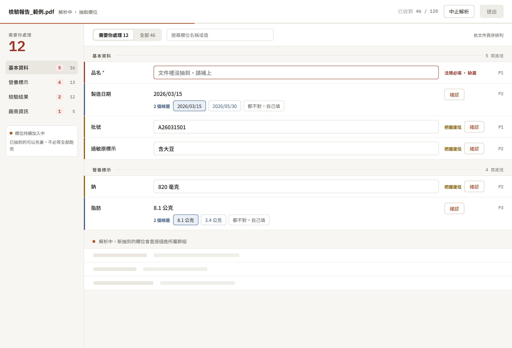
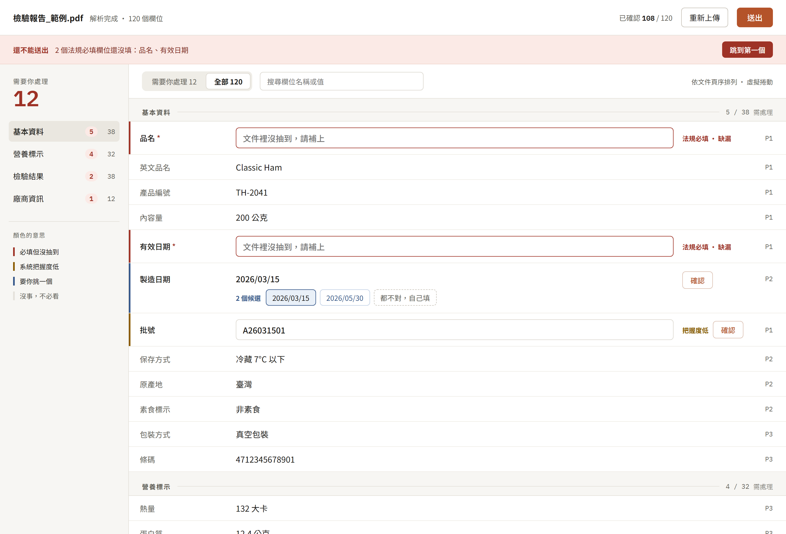
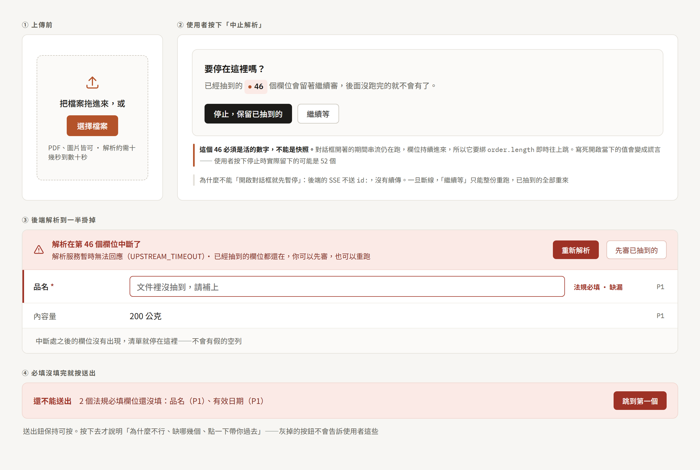
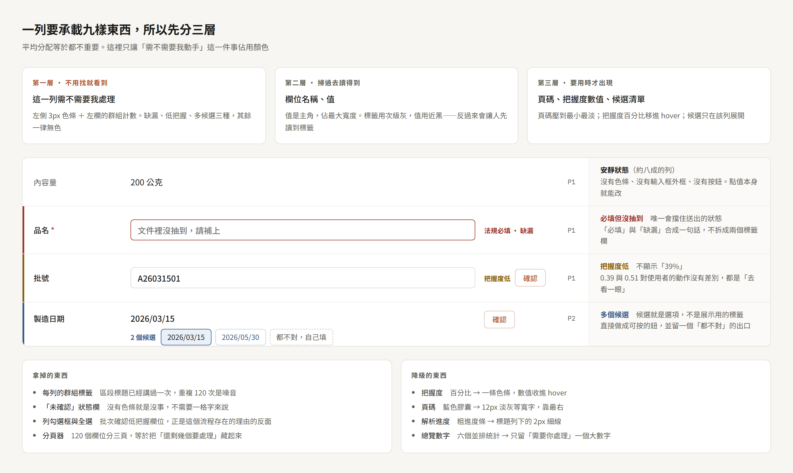

# 文件解析審核前端

上傳文件 → 後端解析（SSE 逐筆串流）→ 使用者確認與修改 — 前端實作題的作答倉庫

- 後端：`mock-backend/`（出題方提供，`server.py` 未修改）
- 前端：`frontend/`
- **專案骨架：[SCAFFOLD.md](SCAFFOLD.md)** — 裝了什麼、為什麼裝、為什麼不裝、設定檔在哪
- **架構說明：[ARCHITECTURE.md](ARCHITECTURE.md)** — 檔案配置、資料流、狀態機、store 依賴關係、元件規劃
- **驗證與判斷紀錄：[REVIEW.md](REVIEW.md)** — 每個判斷的推導過程、實測數據、還沒把握的地方
- 開發紀錄：`log/`

---

## 目前進度

| 項目                     | 狀態      | 範圍                                                                                                                                                                                                                |
| ------------------------ | --------- | ------------------------------------------------------------------------------------------------------------------------------------------------------------------------------------------------------------------- |
| 依賴選型與實測           | ✅ 完成   | 見「決策與開發歷程」                                                                                                                                                                                                |
| 專案骨架與工具鏈         | ✅ 完成   | typecheck / lint / build / test / dev 五項皆通過                                                                                                                                                                    |
| 型別與領域規則           | ✅ 完成   | `ExtractedField` / `FieldDraft` 分離，狀態判準單一來源（[說明](ARCHITECTURE.md#srctypesfieldts--領域型別與唯一的狀態判準)）                                                                                         |
| SSE 傳輸層               | ✅ 完成   | `fetch` ＋ `ReadableStream`，可注入介面、依 HTTP 狀態碼分流（[說明](ARCHITECTURE.md#srcapifetchstreamtransportts--預設傳輸層)）                                                                                     |
| 狀態與 composable        | ✅ 完成   | `useReviewStore` / `useExtraction` / `useFieldFilters`（[依賴圖](ARCHITECTURE.md#store-依賴關係)）                                                                                                                  |
| 上傳 / 解析中 / 審核介面 | ✅ 完成   | 四張設計稿全部實作：拖放上傳、串流邊收邊審、群組導覽與分段搜尋、編輯／確認／挑候選／重設、中止確認、解析中斷、送出阻擋與確認（[元件配置](ARCHITECTURE.md#元件配置)）                                                |
| 防護性測試               | ✅ 125 支 | SSE 分幀、HTTP 狀態分流、中止、解析中途失敗、必填缺漏擋送出、候選答案挑選、重設、重新解析的資料保護、送出、樣式設定、一列的五種狀態、篩選與導覽、送出流程、中止確認與上傳（[清單](ARCHITECTURE.md#測試防的是什麼)） |
| Docker 整合              | ✅ 完成   | 根目錄 `docker-compose.yml` ＋ `frontend/Dockerfile`（多階段 build → nginx），冷啟 20 秒，已實跑驗證                                                                                                                |
| 虛擬捲動                 | ✅ 不做   | 已量測：300 列在 4 倍 CPU 降速下按鍵 p95 3.8ms、捲動不掉幀（[log/07](log/07-300欄位渲染量測.md)）                                                                                                                   |
| 無障礙、跨裝置           | ⬜ 未開始 | 題目列為加分項                                                                                                                                                                                                      |
| 題目指定的 README 問答   | ⬜ 未撰寫 | 九項，見文末清單                                                                                                                                                                                                    |

資料層（型別、傳輸、狀態）已完成並有測試覆蓋。審核畫面已經切版完成，長得跟 `log/design/01-解析中.png` 一致：三區骨架、群組導覽、「需要你處理／全部」分段、搜尋、sticky 區段標題，欄位的編輯／確認／挑候選／重設都能用。送出流程也完成了：確認對話框 → payload 輸出到 console → 完成對話框 → 回到上傳畫面等下一份。上傳、中止確認、解析中斷也都切好了 —— 四張設計稿全部落地

---

## 快速開始

三套跑法，用途不同

### 一、日常開發

改程式碼走這條，存檔立刻看得到：

```bash
docker compose up -d api          # 只起後端，http://localhost:8000
cd frontend && npm run dev        # http://localhost:5173，熱更新
```

指定服務名 `api` 是必要的 —— 不指定會把 `web` 一起拉起來，多等一輪 build 卻完全用不到：它 serve 的是 build 當下凍結的產物，改了 `src/` 也不會變。後端日誌看 `docker compose logs -f api`

前端第一次要先裝：

```bash
cd frontend
npm install
npx playwright install chromium   # 測試在真瀏覽器裡跑，需要下載 Chromium（約 115 MB）
```

其餘指令：

```bash
npm run typecheck  # vue-tsc --noEmit
npm run lint
npm run test       # Vitest browser mode
npm run build
```

### 二、交付驗證

評審打開時看到的東西，跟這條路徑跑出來的一致：

```bash
docker compose up --build         # http://localhost:8080
```

前端是 `npm run build` 的產物交給 nginx，不是 dev server。有五件事只有走這條路徑才驗得到：`VITE_API_BASE` 真的被替換進 bundle、`vue-tsc` 沒被跳過、SSE 沒被中間層緩衝、上傳大檔沒被擋、api 還沒就緒時開頁面會怎樣

`web` 刻意不佔 5173，理由見 `docker-compose.yml` 的註解

### 三、交件前跑一次

```bash
git clone . ../verify && cd ../verify && docker compose up --build
```

從 clone 出來的副本跑，build context 裡只有 git 追蹤到的檔案。這一步專門擋「本機 build 得過，是因為 context 裡有沒提交進 git 的檔案」那一類問題 —— 快取和工作目錄會一路掩護到交件為止

---

## 介面設計

切版示意在 [`log/design/`](log/design/)。**四張都已經照著做出來了。** 這些圖是**設計稿不是螢幕截圖**

一句話總結整份設計的判斷：**顏色只給「要你動手」這一件事，其餘八成的列完全安靜**

### ① 解析中 — 欄位邊串流邊審



`parsing` 與 `review` 不是兩個畫面。SSE 一送來 `field` 就進清單，使用者可以立刻開始審，不必對著空白畫面等數十秒

- 進度退成標題列下的 **2px 細線**，不是畫面主角
- 左欄唯一的大數字是「需要你處理 12」。總數、已確認、低把握、多候選拆成六個並排統計，等於沒有指標
- 底部是骨架列 ＋「欄位持續加入中」，明確告訴使用者這頁還會長

### ② 解析完成 — 全部欄位



120 個欄位裡只有 12 個有色條，其餘安靜。左欄下方有色條圖例，因為顏色是這個畫面唯一的導航工具

頂部的「還不能送出」帶子列出缺哪幾個並提供「跳到第一個」——**送出鈕不灰掉**

### ③ 例外狀態



四種狀況：上傳前、中止確認、後端中途掛掉、必填沒填完就送出

中止對話框裡的 `46` **必須是活的數字**：對話框開著的期間串流仍在跑，它要綁 `order.length` 即時往上跳。寫死開啟當下的值會變成謊言——使用者按下停止時實際留下的可能是 52 個。不能改成「開啟對話框就先暫停」，因為後端 SSE 不送 `id:`，沒有續傳，斷線後「繼續等」只能整份重跑

完整的中止契約見 [REVIEW.md](REVIEW.md#使用者中止的完整流程)

### ④ 一列的解剖 — 九樣資訊怎麼分層



一列要承載標籤、值、把握度、確認狀態、必填、缺漏、候選、群組、頁碼九樣東西。平均分配等於都不重要，所以分三層：

| 層級         | 內容                       | 呈現                               |
| ------------ | -------------------------- | ---------------------------------- |
| 不用找就看到 | 這列需不需要我處理         | 左側 3px 色條，只有三種            |
| 掃過去讀得到 | 欄位名稱、值               | 值是主角，佔最大寬度               |
| 要用時才出現 | 頁碼、把握度數值、候選清單 | 壓到最小最淡／收進 hover／該列展開 |

**拿掉的**：每列的群組標籤（區段標題已講過一次，重複 120 次是噪音）、「未確認」狀態欄、列勾選框與全選、分頁器

**降級的**：把握度百分比 → 色條、頁碼藍色膠囊 → 淡灰等寬小字、粗進度條 → 2px 細線、六個並排統計 → 一個大數字

### 圖怎麼來的

四張 PNG 是用專案既有的 Playwright 把設計稿的 HTML 渲染出來的（2× DPI）。原始的可編輯畫布在 Claude Artifact 上，非公開連結，所以倉庫裡存的是圖片

---

## 技術選型

執行期依賴**只有 `vue` 一個**。工具鏈是 Vite ＋ TypeScript ＋ Tailwind ＋ Vitest（browser mode）＋ ESLint ＋ Prettier

刻意不裝 `pinia`、`vue-router`、`@vueuse/core`、UI 元件庫、`zod`、`msw`、`eventsource`、`happy-dom`

完整清單、每一項的理由、設定檔位置見 **[SCAFFOLD.md](SCAFFOLD.md)**

---

## 決策與開發歷程

> 本專案在 AI 協作下進行，此表記錄每項決策的結果與人工介入程度，實測數據、程式碼與判斷過程放在 `log/`

| #   | 決策            | 結果                                                  | 人工介入     | 紀錄                                                             |
| --- | --------------- | ----------------------------------------------------- | ------------ | ---------------------------------------------------------------- |
| 01  | TypeScript 版本 | 鎖 `~6.0.3`，因為 7.x 會讓 `vue-tsc` 崩潰             | 無           | [詳細](log/01-typescript-版本鎖定.md)                            |
| 02  | 測試環境        | Vitest browser mode + Playwright，不用模擬 DOM        | **指定方向** | [詳細](log/02-測試環境選型.md)                                   |
| 03  | 假後端          | Vite middleware，不用 MSW                             | **推翻結論** | [詳細](log/03-msw-中止驗證.md)                                   |
| 04  | 專案骨架        | 工具鏈五項檢查全綠                                    | 指定範圍     | [詳細](log/04-骨架建置與驗證.md)                                 |
| 05  | 執行期依賴      | 只留 `vue`                                            | 無           | —                                                                |
| 06  | Docker 整合     | compose 移至根目錄，前端 build 產物交給 nginx，不反代 | **選定方案** | [詳細](log/06-docker-整合.md)                                    |
| 07  | 虛擬捲動        | **不做**，實測 300 列不卡，保住 Ctrl+F                | 無           | [詳細](log/07-300欄位渲染量測.md)                                |
| 08  | SSE 傳輸方式    | `EventSource` → `fetch` ＋ `ReadableStream`           | **指定方向** | [詳細](ARCHITECTURE.md#srcapifetchstreamtransportts--預設傳輸層) |
| 09  | 後端位址設定    | 預設值移入 `.env`，程式碼不做執行期判斷               | **指出矛盾** | [詳細](ARCHITECTURE.md#srcapihttpts--位址與錯誤型別)             |
| 10  | 送出規格不明確  | 做不猜規格的版本：完整驗證後顯示 payload，不打 API    | **選定方案** | [詳細](log/08-資料送出規格不明確.md)                             |
| 11  | 介面範圍取捨    | 不做虛擬捲動／RWD／排序／無障礙驗收，語意元素保留     | **逐項確認** | 見「決定不做什麼」                                               |

### 人工介入的三處修正

這三處是 AI 的判斷被人工改掉的地方，對最終架構有實質影響：

**一、Vitest + happy-dom → Playwright browser mode**（[log/02](log/02-測試環境選型.md)）

AI 一開始把 Vitest + happy-dom 當成既定前提在推論，但題目只寫「測試至少一支」，從未指定測試工具 — 那是 AI 自己的選擇卻沒有標示成選擇

人工指出這點後，重新攤開所有選項並指定改用 browser mode，結果是不再需要 `happy-dom`、`jsdom`、`eventsource` polyfill 三個依賴，`EventSource` 直接用原生的，而且樣式與真實鍵盤事件變成可驗證

> 後來決策 08 把傳輸層從 `EventSource` 換成 `fetch` ＋ `ReadableStream`，這裡「原生 `EventSource`」的論據已被取代。browser mode 的結論不變，但理由換成 `fetch`／`ReadableStream`／`TextDecoder` 都是原生的、`AbortController.abort()` 會真的讓後端收到斷線

**二、MSW 中止驗證：`ReadableStream.cancel()` → `request.signal`**（[log/03](log/03-msw-中止驗證.md)）

AI 實測後判定「MSW 驗證不了中止契約」，並以此作為捨棄 MSW 的主要理由

人工提問能否改監聽 `request.signal.aborted`，指出 AI 測錯了掛鉤 — MSW 不是透過 `ReadableStream.cancel()` 傳遞中止；重測確認 `request.signal` 完全有效，伺服器確實會停止產出

原本的推薦理由因此不成立，最終仍維持 browser mode，但理由換成「原生 API 無 polyfill 落差、樣式與互動可測」，而不是「MSW 做不到」

**三、`VITE_API_BASE` 的存在理由寫錯了**（決策 09）

AI 給這個環境變數寫的理由是「進 docker compose 之後服務名會變」，`http.ts` 與 `ARCHITECTURE.md` 兩處都這麼寫

人工指出這句話自相矛盾：發出請求的是使用者的**瀏覽器**，它跑在主機上、不在 compose 網路裡，解析不到 `api` 這個名字。照原句的暗示把值改成 `http://api:8000`，前端會直接連不上後端

環境變數的結論不變，但理由換成真正成立的三種情況：8000 被佔走而改了 `ports`、從區域網路另一台裝置連 `vite --host` 開出來的頁面、部署到 localhost 以外的位址

人工接著指出它是 build-time 的靜態值，執行期沒有「有沒有設」可判斷。於是預設值移進 `frontend/.env`，程式碼從 `(import.meta.env.VITE_API_BASE ?? 'http://localhost:8000').replace(/\/$/, '')` 簡化成直接讀取，並在 `env.d.ts` 補上 `ImportMetaEnv` 讓型別從 `any` 變成 `string`

> 這件事替決策 06（Docker 整合）先定了一條限制：這個值**不能**用 compose 的 `environment:` 注入，那對已經打包好的靜態檔沒有作用，得在 build 那一步就給 —— 已落實，見 [log/06](log/06-docker-整合.md)

### 其他過程中的錯誤

回報套件安裝成功時讀的是 `tail` 的 exit code 而非 npm 的，導致 devDependencies 整批失敗卻回報成功，細節見 [log/04](log/04-骨架建置與驗證.md)

---

## 題目指定的 README 項目（尚未撰寫）

- [ ] `AI產生的介面_參考.png` 最嚴重的三個問題，以及自己的版本怎麼處理
- [ ] 怎麼驗證這東西真的能動 — 實際試過哪些情況、怎麼試的、試出什麼問題
- [ ] 哪些是 AI 寫的、改了什麼、為什麼改
- [ ] 這份 code 裡最不確定的是哪一段
- [ ] 需求哪裡沒講清楚、如何假設
- [ ] 決定不顯示或降級顯示哪些資訊
- [ ] 哪兩條需求互相衝突、如何取捨
- [x] 決定不做什麼 —— 見下方「[決定不做什麼](#決定不做什麼)」
- [ ] 想問的三個問題

## 決定不做什麼

題目問「決定不做什麼」，四項，全部是有理由的取捨而不是沒時間：

### 一、虛擬捲動

實測 300 列在 4 倍 CPU 降速下按鍵 p95 只有 3.8ms、捲動不掉幀，1000 列（後端上限的 3.3 倍）
也只有 9.3ms。做了只會犧牲瀏覽器原生的 Ctrl+F，還要處理可變列高
（[log/07](log/07-300欄位渲染量測.md)）

### 二、跨裝置 RWD

題目列為「有餘力再做」，而這份作業的重點在資訊層級的判斷，不在斷點。

**但「不做 RWD」不等於「窄螢幕爆版」**——版面根層設 `min-width`，窄螢幕橫向捲動而不是錯位。
這兩件事差很多：前者是取捨，後者是 bug

### 三、欄位排序

參考圖有「排序：預設／把握度」兩個下拉，這版拿掉了。理由不是「排序沒用」，是
**排序會破壞一個明確的需求**：題目要求「同一組的要能一起看」，而依把握度排序必然打散群組。

而且排序的主要使用情境（先處理最不確定的）已經被「需要你處理／全部」這個分段涵蓋，
差別是分段不破壞群組

### 四、無障礙的專門驗收

不做鍵盤全走查、讀螢幕器測試、對比度稽核。

**但語意元素要保留**：真的 `<button>` 而不是 `<div @click>`、輸入框配 `<label>`、
圖示按鈕給 `aria-label`。這三件事成本是零（設計稿本來就這樣畫），
但事後補要重寫元件——`<div @click>` 改成 `<button>` 會連帶動到樣式與事件

所以這一項的正確說法是「不做無障礙驗收」，不是「不考慮無障礙」

---

## 規格未提到的部分

- 低把握度的界線 `0.7`，推估應由後台設置並由後端提供
- 顯示的欄位 `ID` 並非唯一值而是序號，在使用者中斷後重新解析的過程會發生欄位衝突
- **資料送出給後端的規格不明確**。mock 後端只有上傳、解析、健康檢查三支，但需求明講必填未填「不能就這樣送出去」——真實系統一定有接收端，只是這份題目沒給規格。目前做法是不對規格做假設：前端完整驗證後顯示 payload 並說明未實際送出（[log/08](log/08-資料送出規格不明確.md)）
