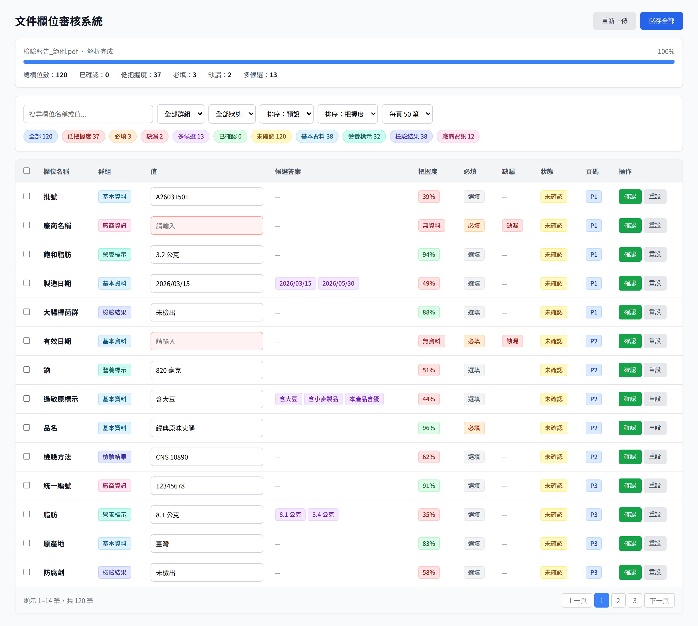

# 文件解析審核前端 (希望有更多時間製作，會在中秋假期完成)

## 你好，雖然我已經委託窗口提交本次的製作，由於我沒有和窗口取得對各位評審的聯繫方式，故只能透過 README 的方式留下記錄。

## 但我希望能從前期再重新設計一次，由於實作是檢測個人能力程度，而非實作的完成度。

## 於近期，將透過 git 紀錄返回前期重新開發，以下資料可能不會使用。

上傳文件 → 後端解析（SSE 逐筆串流）→ 使用者確認與修改 — 前端實作題的作答倉庫

- 後端：`mock-backend/`（出題方提供，`server.py` 未修改）
- 前端：`frontend/`
- **專案骨架：[SCAFFOLD.md](SCAFFOLD.md)** — 裝了什麼、為什麼裝、為什麼不裝、設定檔在哪
- **架構說明：[ARCHITECTURE.md](ARCHITECTURE.md)** — 檔案配置、資料流、狀態機、store 依賴關係、元件規劃
- **驗證與判斷紀錄：[REVIEW.md](REVIEW.md)** — 每個判斷的推導過程、實測數據、還沒把握的地方
- 開發紀錄：`log/`

---

## 開發階段

| 項目                     | 狀態        | 範圍                                                                                                                                                                                                                |
| ------------------------ | ----------- | ------------------------------------------------------------------------------------------------------------------------------------------------------------------------------------------------------------------- |
| 依賴選型與實測           | ✅ 完成     | 見「決策與開發歷程」                                                                                                                                                                                                |
| 專案骨架與工具鏈         | ✅ 完成     | typecheck / lint / build / test / dev 五項皆通過                                                                                                                                                                    |
| 型別與領域規則           | ✅ 完成     | `ExtractedField` / `FieldDraft` 分離，狀態判準單一來源（[說明](ARCHITECTURE.md#srctypesfieldts--領域型別與唯一的狀態判準)）                                                                                         |
| SSE 傳輸層               | ✅ 完成     | `fetch` ＋ `ReadableStream`，可注入介面、依 HTTP 狀態碼分流（[說明](ARCHITECTURE.md#srcapifetchstreamtransportts--預設傳輸層)）                                                                                     |
| 狀態與 composable        | ✅ 完成     | `useReviewStore` / `useExtraction` / `useFieldFilters`（[依賴圖](ARCHITECTURE.md#store-依賴關係)）                                                                                                                  |
| 上傳 / 解析中 / 審核介面 | ✅ 完成     | 四張設計稿全部實作：拖放上傳、串流邊收邊審、群組導覽與分段搜尋、編輯／確認／挑候選／重設、中止確認、解析中斷、送出阻擋與確認（[元件配置](ARCHITECTURE.md#元件配置)）                                                |
| 防護性測試               | ✅ 126 支   | SSE 分幀、HTTP 狀態分流、中止、解析中途失敗、必填缺漏擋送出、候選答案挑選、重設、重新解析的資料保護、送出、樣式設定、一列的五種狀態、篩選與導覽、送出流程、中止確認與上傳（[清單](ARCHITECTURE.md#測試防的是什麼)） |
| Docker 整合              | ✅ 完成     | 根目錄 `docker-compose.yml` ＋ `frontend/Dockerfile`（多階段 build → nginx），冷啟 20 秒，已實跑驗證                                                                                                                |
| 虛擬捲動                 | ✅ 不做     | 已量測：300 列在 4 倍 CPU 降速下按鍵 p95 3.8ms、捲動不掉幀（[log/07](log/07-300欄位渲染量測.md)）                                                                                                                   |
| 無障礙、跨裝置           | 🟡 部分完成 | 題目列為加分項                                                                                                                                                                                                      |

---

## 為什麼先做這個、後做那個

- 專案會先進行 NPM 套件規劃，評估整體專案需使用的 scaffold，包括程式碼風格等，這些決策是優先於實際開發階段的
- RWD 設計會影響到裝置閾值的設定，正式專案應於評估階段時一併考慮。本專案列為加分項目，則不包含手機版設計（但有防止跑版的設定）
- 骨架建立後先從本專案的核心，SSE 傳輸開始撰寫功能。並在過程中使用純 HTML 的方式驗證 SSE 傳輸是否有效（僅存於 commit `c5e8c2e` 的 App.vue 記錄中，無存留測試樣版）
- 單元測試和核心或元件開發時同時撰寫，並且於開發階段中測試修改是否正確，或有新的測試條件會視情況追加
- 無障礙設計在於元件設計前期會加入考量，例如使用符合語意的 button 標籤，完整的無障礙則放到使用者流程全部確認後再追加

實際上，在本專案開發時，過於追求系統整體能運作，在未能徹底掌握程式碼運作前提下導致技術債堆疊。若有其他類似開發機會，應在每個階段審視程式碼與單元測試內容

技術債請參考下方「不確定的部分」

## 介面問題回覆

> 這張圖你覺得最嚴重的三個問題是什麼？為什麼？你自己的版本怎麼處理？



| 舊版設計                         | 缺點                                                       | 新版設計                                                       |
| -------------------------------- | ---------------------------------------------------------- | -------------------------------------------------------------- |
| 分頁 UI 樣式                     | 要翻頁才看得到下一個待處理欄位，也沒辦法用 Ctrl+F 搜尋整份 | 移除分頁設計                                                   |
| tab 標籤：全部、必填、營養標示等 | 資訊上應屬於不同層級的過濾方式                             | 拆成兩個地方：左側群組列管群組，上方分段管「需要你處理／全部」 |
| 每筆資料過多的 tag 和欄位        | 會造成應該關注的欄位失焦                                   | 簡化成色帶顯示、重點於輸入區域和參考資料降級顯示               |

**設計要點**

一列要承載標籤、值、把握度、確認狀態、必填、缺漏、候選、群組、頁碼九樣東西，平均分配等於都不重要，所以分三層：

| 資料列區域 | 範例                         | 呈現                 |
| ---------- | ---------------------------- | -------------------- |
| 色帶顯示   | 這列需不需要我處理（無色帶） | 左側 3px 色條        |
| 輸入區域   | 欄位名稱、值                 | 值是主角，佔最大寬度 |
| 參考資料   | 頁碼、把握度數值、候選清單   | 壓到最小最淡         |

色帶代表意義：

- 紅：必填缺漏
- 黃：已補值待確認，或把握度低
- 藍：多個候選
- 無：不需要處理

## 怎麼確認它是對的

哪些情況你實際試過、怎麼試的、有沒有試出問題

把握度經過 AI 測試，分布在 0.68 到 0.82 之間沒有資料，建置時以 `0.7` 假定為靜態值，系統也以此前提下進行設計

**怎麼試**

- **自動化測試 126 支**：跑在 Vitest browser mode（真 Chromium），`fetch`、`ReadableStream`、`AbortController` 都是原生的。每支對應一個「有人改壞會怎樣」的情境（[清單](ARCHITECTURE.md#測試防的是什麼)）
- **對真實 mock 後端實跑**：`server.py` 未修改，透過上傳頁的「解析參數（手動驗證用）」調整 `field_count`、`speed`、`fail_at`，放大欄位數、拉長串流或讓解析中途失敗
- **直接讀後端產生邏輯並抽樣**：把 `_make_fields()` 重複跑數百次看分布
- **效能量測**：DevTools 4 倍 CPU 降速下量 300／1000 列的按鍵延遲與捲動
- **Docker 實跑**：`docker compose up --build` 冷啟約 20 秒

**試過的情況**

| 情況          | 怎麼試                                                   | 結果                                                                             |
| ------------- | -------------------------------------------------------- | -------------------------------------------------------------------------------- |
| SSE 分幀邊界  | 逐字元切 chunk、`\r\n` 切在中間、中文字跨 chunk          | 都能還原                                                                         |
| HTTP 失敗分流 | 404、400、沒送 `done` 就斷線                             | 分成過期、參數錯誤、串流截斷三種，過期時只給「重新上傳」                         |
| 中途中止      | 串流中按中止                                             | 欄位保留、不誤報連線錯誤，對話框數字隨串流跳動                                   |
| 解析中途失敗  | 模擬後端在串流中送 `error` 事件，以及 `document_id` 失效 | 已收到的欄位保留、出現解析中斷說明；一般失敗可以重試，文件失效時只給「重新上傳」 |
| 候選答案挑選  | 挑候選、挑完再改值                                       | 挑完就離開待處理，改值後回到「多個候選」                                         |
| 必填缺漏      | 留空、只填空白                                           | 都擋得住送出                                                                     |
| 重新解析      | `_make_fields(18)` 跑兩次，比對同一 `id` 的 `label`      | 0／18 相同（欄位可以視為隨機 ID）                                                |
| 把握度分布    | 24000 個欄位                                             | 0.68 到 0.82 之間一筆都沒有                                                      |
| 大量欄位      | 300 列、1000 列                                          | 按鍵 p95 分別 3.8ms、9.3ms，不做虛擬捲動                                         |

**沒把握的部分**

以下因時間因素並未人工審查評估

- HTTP 失敗狀態
- 欄位效能損失的判斷
- Docker 相關技術不到非常熟悉，較無法判斷啟動與效能優化的關連性

## 哪些是 AI 寫的、改了什麼、為什麼改

**分工**

- **AI 寫的**：程式碼、測試、量測腳本與文件初稿，全部由 Claude Code 產出
- **人工負責**：定方向與範圍、審查 AI 的推論、指出錯誤、拍板有分歧的方案，並撰寫以下各節的內容（介面問題回覆、開發順序、不確定的部分、需求假設和衝突）

每項決策的人工介入程度記在「[決策與開發歷程](#決策與開發歷程)」

**人工改掉的 AI 判斷**

| AI 原本的做法                                         | 改成                                                | 為什麼改                                                                                                                 |
| ----------------------------------------------------- | --------------------------------------------------- | ------------------------------------------------------------------------------------------------------------------------ |
| 把 Vitest ＋ happy-dom 當成既定前提                   | Vitest browser mode ＋ Playwright                   | 題目沒指定測試工具，那是 AI 自己的選擇卻沒標示。改完少三個依賴，樣式與鍵盤事件也能測（[log/02](log/02-測試環境選型.md)） |
| 判定 MSW 驗證不了中止                                 | 改監聽 `request.signal`，結論推翻                   | AI 測錯了掛鉤，捨棄 MSW 的主要理由因此不成立（[log/03](log/03-msw-中止驗證.md)）                                         |
| `VITE_API_BASE` 的理由寫成「進 compose 後服務名會變」 | 理由改寫，預設值移進 `.env`                         | 發請求的是主機上的瀏覽器，不在 compose 網路裡，照原句改會直接連不上後端                                                  |
| Docker 整合有三種做法都說得通                         | 人工拍板：compose 移至根目錄、跑 build 產物、不反代 | 三個分歧點都是取捨，不是對錯，由人決定（[log/06](log/06-docker-整合.md)）                                                |
| 骨架階段的範圍沒有限定                                | 限定只建骨架，`App.vue` 不寫內容                    | 先讓工具鏈五項檢查全綠，再進功能（[log/04](log/04-骨架建置與驗證.md)）                                                   |

**AI 第一版有問題、後來修掉的**

| 第一版                                                  | 問題                                                     | 修正                                       |
| ------------------------------------------------------- | -------------------------------------------------------- | ------------------------------------------ |
| 輸入框改值就算處理完                                    | 第一個字打下去那列就被移動到已確認                       | 只有按確認才算完成，改值會清掉確認         |
| AI 假定欄位 `ID` 為靜態值的前提，重新解析後將新欄位加上 | 使用者的修改靜默消失；且後端 `ID` 非靜態，照做會汙染資料 | 重新解析前先跳窗確認，明確警告資料無法復原 |

**不確定的部分**

以下因時間因素無法完成或未能掌握

- 串流如果在必填欄位送達前就中斷，送出不會被擋下 -> 尚未建立對應測試項目
- HTTP 狀態界定（`describeHttpFailure`）、資料欄位編輯狀態界定（`resolveStatus` 的判斷優先序）
- 單元測試僅供 AI 修改時是否動到舊有規則，並沒有詳細全部閱讀
- 介面設計的部分由 AI 產出，應將內文潤飾後再重新上傳
- 元件的說明由 AI 產出，應將內文潤飾並理解其機制

## README 順便回答五件事

### 需求哪裡沒講清楚、如何假設

**1. 重新解析時，使用者的修改要不要保留**

mock 實際上是隨機產生 `ID`，`重新解析` 會把「品名」的修改套到別的欄位上

假設 `重新解析` 無法更新欄位，需在按下重新解析前跳窗警告使用者

**2. 資料送出給後端的規格不明確**

實務上會有後端接口，由於規格未提到，目前以 console log 方式呈現

**3. 確認送出後，需要可以重複修改**

如果存在重複修改的需求，那會有一份已經建立 `document_id` 的文件進行修改

後端應該是根據 `document_id` 取回文件狀態，取得後使用者再進行修改

目前設計是以此為前提下送出後不清空資料

**4. 填寫公制單位可能有更好的作法**

例如，填寫毫克、克、公斤和大卡都是常用的項目

目前的輸入框是可以任意填寫，若限定單位，可以改用下拉選單

**5. 低把握度界線 0.7 只是假定的變數**

它落在 mock 雙峰分布的空隙裡，設 0.69 或 0.81 結果都一樣（[REVIEW](REVIEW.md#低把握度界線-07-的推導)）

實務上，推估為後台設定後由後端接口回傳

**6. 法規必填填寫後是否可以直接送出**

是否應將低把握度列為必須按下確認後才能送出

目前假定是不需要確認，故只檢查法規必填

### 決定不顯示或降級顯示哪些資訊

**拿掉的**

- 每列的群組標籤 → 區段標題已經重複過
- 「未確認」狀態欄列 → 八成的列都會顯示「未確認」參考度較低
- 勾選框與全選 → 從設計圖看不出實際作用
- 頁數顯示筆數 & pager → 逐筆審查比較適合一頁捲動式設計

**降級的**

- 把握度百分比 → 色帶顯示（見上方色帶說明）
- 原始文件頁碼 → 淡灰等寬小字（僅供使用者參考原本文件，重要度低）
- 粗進度條 → 2px 細線（解析進度於完成後其實不太重要）
- 所有欄位並排統計 → 一個大數字（使用者只關心還有多少沒做完）

### 哪兩條需求互相衝突、如何取捨

一份清單只能照一種方式由上往下排：照群組排，要檢查的欄位就散在各組；把要檢查的欄位集中到前面，群組就被打散

若依低把握度排序：

- 判斷一個值需要同組的其他欄位對照，例如：「有效日期」要和「製造日期」對照
- 和原文件對不起來：後端是照文件順序送回，排序後對於反查文件的意義不大

若侷限同組一起觀看，且無標示：

- 120 個欄位裡只有 12 個要處理，分散在四組，使用者得從頭捲到尾自己找
- 欄位上百個時很容易漏看

目前解法：
**群組內用色條標示，再加上「需要你處理」篩選**

取捨與代價：

- 切換「需要你處理」時會失去對照：這個模式把同組不用處理的欄位也藏起來了。要對照「熱量」和「蛋白質」，得切回「全部」
- 沒有輕重緩急：把握度 0.31 和 0.65 是同一種色條，使用者沒辦法先處理最沒把握的

### 決定不做什麼

**1. 跨裝置 RWD**

題目列為「有餘力再做」，不在裝置閾值多加判斷

但版面設有 `min-width`，在窄螢幕是橫向捲動而不是跑版

**2. 無障礙的驗收**

此專案是「考慮無障礙」為前提進行開發

但不做鍵盤全走查、讀螢幕器測試、對比度稽核

**語意元素要保留**：真的 `<button>` 而不是 `<div @click>`、輸入框配 `<label>`、圖示按鈕給 `aria-label`

**3. 實際呼叫送出 API**

由於規格未提到，目前以 console log 方式呈現

**4. 文件中斷後續傳**

後端 SSE 不送 `id:`，而且每次請求都重新隨機產生欄位，重連拿到的是另一批結果，故中斷續傳不考慮實作

**5. 重新整理頁面後資料會消失**

有可能需要使用 vue-router 或是 URL 解析取得 parameter 請求後端資料，但後端沒有對應接口，故沒有實作

**6. 虛擬捲動**

實測 300 列在 4 倍 CPU 降速下按鍵 p95 3.8ms，不需要；不做也保留了整頁 Ctrl+F（[log/07](log/07-300欄位渲染量測.md)）

**7. 排序**

會打散群組，見「[哪兩條需求互相衝突、如何取捨](#哪兩條需求互相衝突如何取捨)」

### 想問的三個問題

1. 想詢問貴公司開發的框架是否包含其他種類，如 Angular 或 React
2. 專案合作的模式會如何進行：例如，一位 SA、一位前端和一位後端進行專案開發
3. 如有機會在貴公司上班，請問未來在系統維護案和新專案開發的比例大概會如何分配

## 快速開始

**直接看成品**（前端 build 後交給 nginx）：

```bash
docker compose up --build         # http://localhost:8080
```

**開發**（只起後端，前端走 dev server 熱更新）：

```bash
docker compose up -d api          # http://localhost:8000
cd frontend
npm install
npx playwright install chromium   # 測試用，約 115 MB
npm run dev                       # http://localhost:5173
```

**手動驗證**：上傳頁底部的「解析參數（手動驗證用）」可以調整後端的解析行為

| 參數             | 預設              | 用途                           |
| ---------------- | ----------------- | ------------------------------ |
| 欄位數           | 60（後端預設 18） | 驗證上百個欄位的情境，上限 300 |
| 速度倍率         | 1                 | 調小可以拉長串流，方便測試中止 |
| 於第幾個欄位失敗 | -1（不啟用）      | 重現「後端解析到一半掛掉」     |

檢查指令：`npm run typecheck`、`npm run lint`、`npm run test`、`npm run build`

兩條路徑的差異與設計理由見 [log/06](log/06-docker-整合.md)

---

## 介面設計

以下 AI 設計稿說明尚未經過人供校對，語意會略顯不合人類閱讀方式

### ① 解析中 — 欄位邊串流邊審


`parsing` 與 `review` 不是兩個畫面。SSE 一送來 `field` 就進清單，使用者可以立刻開始審，不必對著空白畫面等數十秒

- 進度退成標題列下的 **2px 細線**，不是畫面主角
- 左欄唯一的大數字是「需要你處理 12」。總數、已確認、低把握、多候選拆成六個並排統計，等於沒有指標
- 底部是骨架列 ＋「欄位持續加入中」，明確告訴使用者這頁還會長

### ② 解析完成 — 全部欄位


120 個欄位裡只有 12 個有色條，其餘安靜。左欄下方有色條圖例，因為顏色是這個畫面唯一的導航工具

頂部的「還不能送出」帶子列出缺哪幾個並提供「跳到第一個」——**送出鈕不灰掉**

### ③ 例外狀態


四種狀況：上傳前、中止確認、後端中途掛掉、必填沒填完就送出

中止對話框裡的 `46` **必須是活的數字**：對話框開著的期間串流仍在跑，它要綁 `order.length` 即時往上跳。寫死開啟當下的值會變成謊言——使用者按下停止時實際留下的可能是 52 個。不能改成「開啟對話框就先暫停」，因為後端 SSE 不送 `id:`，沒有續傳，斷線後「繼續等」只能整份重跑

完整的中止契約見 [REVIEW.md](REVIEW.md#使用者中止的完整流程)

### ④ 一列的解剖 — 九樣資訊怎麼分層


一列要承載標籤、值、把握度、確認狀態、必填、缺漏、候選、群組、頁碼九樣東西

### 圖怎麼來的

四張 PNG 是用專案既有的 Playwright 把設計稿的 HTML 渲染出來的（2× DPI）。原始的可編輯畫布在 Claude Artifact 上，非公開連結，所以倉庫裡存的是圖片

---

## 技術選型

執行期依賴**只有 `vue` 一個**。工具鏈是 Vite ＋ TypeScript ＋ Tailwind ＋ Vitest（browser mode）＋ ESLint ＋ Prettier

刻意不裝 `pinia`、`vue-router`、`@vueuse/core`、UI 元件庫、`zod`、`msw`、`eventsource`、`happy-dom`

完整清單、每一項的理由、設定檔位置見 **[SCAFFOLD.md](SCAFFOLD.md)**

---

## 決策與開發歷程

> 本專案在 AI 協作下進行，此表記錄每項決策的結果與人工介入程度，實測數據、程式碼與判斷過程放在 `log/`

| #   | 決策            | 結果                                                  | 人工介入     | 紀錄                                                             |
| --- | --------------- | ----------------------------------------------------- | ------------ | ---------------------------------------------------------------- |
| 01  | TypeScript 版本 | 鎖 `~6.0.3`，因為 7.x 會讓 `vue-tsc` 崩潰             | 無           | [詳細](log/01-typescript-版本鎖定.md)                            |
| 02  | 測試環境        | Vitest browser mode + Playwright，不用模擬 DOM        | **指定方向** | [詳細](log/02-測試環境選型.md)                                   |
| 03  | 假後端          | Vite middleware，不用 MSW                             | **推翻結論** | [詳細](log/03-msw-中止驗證.md)                                   |
| 04  | 專案骨架        | 工具鏈五項檢查全綠                                    | 指定範圍     | [詳細](log/04-骨架建置與驗證.md)                                 |
| 05  | 執行期依賴      | 只留 `vue`                                            | 無           | —                                                                |
| 06  | Docker 整合     | compose 移至根目錄，前端 build 產物交給 nginx，不反代 | **選定方案** | [詳細](log/06-docker-整合.md)                                    |
| 07  | 虛擬捲動        | **不做**，實測 300 列不卡，保住 Ctrl+F                | 無           | [詳細](log/07-300欄位渲染量測.md)                                |
| 08  | SSE 傳輸方式    | `EventSource` → `fetch` ＋ `ReadableStream`           | **指定方向** | [詳細](ARCHITECTURE.md#srcapifetchstreamtransportts--預設傳輸層) |
| 09  | 後端位址設定    | 預設值移入 `.env`，程式碼不做執行期判斷               | **指出矛盾** | [詳細](ARCHITECTURE.md#srcapihttpts--位址與錯誤型別)             |
| 10  | 送出規格不明確  | 做不猜規格的版本：完整驗證後輸出 payload，不打 API    | **選定方案** | [詳細](log/08-資料送出規格不明確.md)                             |
| 11  | 介面範圍取捨    | 不做虛擬捲動／RWD／排序／無障礙驗收，語意元素保留     | **逐項確認** | 見「決定不做什麼」                                               |

### 人工介入的三處修正

這三處是 AI 的判斷被人工改掉的地方，對最終架構有實質影響：

**一、Vitest + happy-dom → Playwright browser mode**（[log/02](log/02-測試環境選型.md)）

AI 一開始把 Vitest + happy-dom 當成既定前提在推論，但題目只寫「測試至少一支」，從未指定測試工具 — 那是 AI 自己的選擇卻沒有標示成選擇

人工指出這點後，重新攤開所有選項並指定改用 browser mode，結果是不再需要 `happy-dom`、`jsdom`、`eventsource` polyfill 三個依賴，`EventSource` 直接用原生的，而且樣式與真實鍵盤事件變成可驗證

> 後來決策 08 把傳輸層從 `EventSource` 換成 `fetch` ＋ `ReadableStream`，這裡「原生 `EventSource`」的論據已被取代。browser mode 的結論不變，但理由換成 `fetch`／`ReadableStream`／`TextDecoder` 都是原生的、`AbortController.abort()` 會真的讓後端收到斷線

**二、MSW 中止驗證：`ReadableStream.cancel()` → `request.signal`**（[log/03](log/03-msw-中止驗證.md)）

AI 實測後判定「MSW 驗證不了中止契約」，並以此作為捨棄 MSW 的主要理由

人工提問能否改監聽 `request.signal.aborted`，指出 AI 測錯了掛鉤 — MSW 不是透過 `ReadableStream.cancel()` 傳遞中止；重測確認 `request.signal` 完全有效，伺服器確實會停止產出

原本的推薦理由因此不成立，最終仍維持 browser mode，但理由換成「原生 API 無 polyfill 落差、樣式與互動可測」，而不是「MSW 做不到」

**三、`VITE_API_BASE` 的存在理由寫錯了**（決策 09）

AI 給這個環境變數寫的理由是「進 docker compose 之後服務名會變」，`http.ts` 與 `ARCHITECTURE.md` 兩處都這麼寫

人工指出這句話自相矛盾：發出請求的是使用者的**瀏覽器**，它跑在主機上、不在 compose 網路裡，解析不到 `api` 這個名字。照原句的暗示把值改成 `http://api:8000`，前端會直接連不上後端

環境變數的結論不變，但理由換成真正成立的三種情況：8000 被佔走而改了 `ports`、從區域網路另一台裝置連 `vite --host` 開出來的頁面、部署到 localhost 以外的位址

人工接著指出它是 build-time 的靜態值，執行期沒有「有沒有設」可判斷。於是預設值移進 `frontend/.env`，程式碼從 `(import.meta.env.VITE_API_BASE ?? 'http://localhost:8000').replace(/\/$/, '')` 簡化成直接讀取，並在 `env.d.ts` 補上 `ImportMetaEnv` 讓型別從 `any` 變成 `string`

> 這件事替決策 06（Docker 整合）先定了一條限制：這個值**不能**用 compose 的 `environment:` 注入，那對已經打包好的靜態檔沒有作用，得在 build 那一步就給 —— 已落實，見 [log/06](log/06-docker-整合.md)

### 其他過程中的錯誤

回報套件安裝成功時讀的是 `tail` 的 exit code 而非 npm 的，導致 devDependencies 整批失敗卻回報成功，細節見 [log/04](log/04-骨架建置與驗證.md)

---
