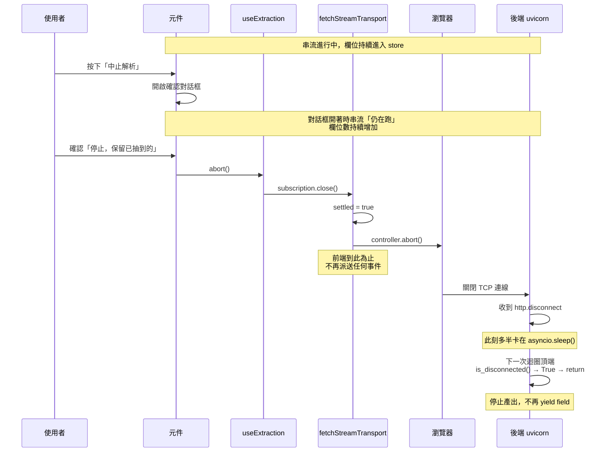

# 驗證與判斷紀錄

ARCHITECTURE.md 說明系統長什麼樣；這份文件說明**為什麼這樣決定、怎麼確認它是對的、哪裡還沒把握**

把推導過程另外放，是因為兩種讀者要的東西不同：接手改程式的人想快速知道有哪些檔案、資料往哪流；
要判斷這些決定合不合理的人，想看的是數據與被否決的選項

| 文件                               | 回答什麼                                     |
| ---------------------------------- | -------------------------------------------- |
| [README.md](README.md)             | 這是什麼、怎麼跑、目前做到哪、介面長什麼樣   |
| [SCAFFOLD.md](SCAFFOLD.md)         | 裝了什麼、為什麼、設定檔在哪                 |
| [ARCHITECTURE.md](ARCHITECTURE.md) | 系統長什麼樣、每個檔案為什麼存在             |
| REVIEW.md（本文）                  | 每個判斷的推導過程、實測數據、還沒把握的地方 |

本文提到的實測都是對 `mock-backend/server.py` 跑出來的，`server.py` 未經修改

---

## 使用者中止的完整流程

題目列的需求之一是「跑到一半使用者可能就不想等了」。這一節說明按下中止之後實際發生什麼，以及為什麼後端真的會停

### 時序



### 兩段的時間點不同

**前端是立即的**：`settled = true` 之後 `handlers.onField` 再也不會被呼叫，一個欄位都不會再進清單。`AbortError` 被 `isAbort()` 吃掉，所以**不會冒出 `CONNECTION_LOST`**——中止是使用者的意圖，不是錯誤

**後端有一點延遲**：[server.py](mock-backend/server.py) 的 `is_disconnected()` 檢查在迴圈頂端，中止時後端多半正卡在 `await asyncio.sleep()`

| 所在迴圈   | sleep 區間（`speed=1`）      | 最長延遲  |
| ---------- | ---------------------------- | --------- |
| 欄位迴圈   | `delay × uniform(0.15, 0.5)` | 約 0.6 秒 |
| stage 迴圈 | `delay × uniform(0.8, 1.6)`  | 約 1.9 秒 |

關鍵是檢查點在 `yield _sse("field", ...)` **之前**，所以這段延遲期間不會再吐出任何欄位。答案很明確：**中止後畫面不會繼續長出資料**

### 對話框期間串流不暫停 —— 這是被後端契約逼出來的

確認對話框上寫著「已經抽到的 **46** 個欄位會留著」。`abort()` 是在按下「停止」時才呼叫的，所以對話框開著的那幾秒串流還在跑

這導致兩條必須遵守的規則：

**一、`46` 必須綁 `store.order.value.length`，不能是開啟當下的快照**

寫死快照會變成謊言：使用者按下停止時實際留下的可能是 52 個。數字在對話框裡往上跳反而是對的，它正好說明「你還在等的東西還在進來」

**二、不能改成「開啟對話框就先暫停」**

後端的 `_sse()` 不送 `id:`，沒有 `Last-Event-ID` 續傳。一旦斷線，「繼續等」就只能整份重跑，已經抽到的 46 個會全部重來。同理，「中止後給一顆繼續解析」也不成立——那顆按鈕同樣做不到續傳

保留對話框 ＋ 活的數字是目前唯一自洽的選項

### 中止與失敗的差別

|               | `aborted`    | `failed`                          |
| ------------- | ------------ | --------------------------------- |
| 觸發          | 使用者按中止 | `error` 事件、HTTP 失敗、串流截斷 |
| 已抽欄位      | 保留         | 保留                              |
| `streamError` | `null`       | 有值                              |
| `canRetry`    | `true`       | `DOCUMENT_EXPIRED` 時為 `false`   |
| 畫面          | 「繼續解析」 | 「重新解析」或「重新上傳」        |

兩者都保留欄位，所以 `canRetry` 的判斷涵蓋 `aborted` 與 `failed` 兩種 phase

### 重新解析會丟掉什麼

中止或失敗之後按「重新解析」，**使用者所有的修改與確認都會消失**。這不是偷懶，是後端契約逼出來的

**後端的 `id` 跨解析不穩定**

[server.py](mock-backend/server.py) 產生欄位的順序是：

```python
random.shuffle(picked)                      # 先洗牌
for i, (...) in enumerate(picked):
    field = {"id": f"f{i + 1}", ...}        # 才用位置編號
    "value": random.choice(values)          # 值也重骰
```

`id` 是**洗牌之後的位置序號**，不是欄位身分。實測把 `_make_fields(18)` 跑兩次比對同一個 `id` 對應的 `label`：

```
id   第一次      第二次     相同?
f7   產品編號     品名       否
f14  品名        產品編號    否
...
label 相同的：0/18

「品名」第一次的 id=f14 value='煙燻雞胸肉片'
「品名」第二次的 id=f7  value=''
```

連「哪幾個必填欄位是缺漏的」每次都重骰——第二次「品名」變成沒抽到

**所以以 `id` 合併是不可行的**。把使用者對「品名」的修改套到現在叫「鈉」的欄位上，是靜默的資料汙染，比整批丟掉更糟。`applyField` 裡的 `if (!drafts.has(...))` 只防同一條串流內的重送，**不是**跨解析的合併機制，該處有註解鎖住這件事

**採取的做法：確認後丟棄**

```ts
type RetryOutcome = 'started' | 'needs-confirm' | 'unavailable'

retry() // 有修改 → 'needs-confirm'
retry({ discardEdits: true }) // 確認過 → 'started'
```

| 狀態                 | 行為                                                     |
| -------------------- | -------------------------------------------------------- |
| 沒有任何修改         | 直接重跑，不多問一句                                     |
| 有修改或確認         | 回 `'needs-confirm'`，UI 顯示「會丟掉你改過的 N 個欄位」 |
| `document_id` 已失效 | 回 `'unavailable'`，UI 引導重新上傳                      |

`retry()` 回傳三態而不是 `boolean`，因為 `unavailable` 與 `needs-confirm` 在畫面上走完全不同的路，用 `false` 表示會把兩者混在一起

`store.hasUserEdits` 把「按過確認」也算進去——那同樣是使用者花時間做出的判斷。只看 `touched` 會讓「審完 40 個高把握欄位」這種工作在警告裡被當成不存在

`resetExtraction()` 改名為 `discardExtraction()`，讓呼叫端從名字就看得出它會丟東西

**考慮過但沒採用的兩條**

| 方案                 | 不採用的理由                                                                                                                                                                         |
| -------------------- | ------------------------------------------------------------------------------------------------------------------------------------------------------------------------------------ |
| 以 `label` 為鍵合併  | `label` 在同一份結果裡不重複，技術上可行。但重跑後欄位集合會變（品名這次可能是缺漏的），而且「使用者改的是上一次抽到的錯值，新的一次可能抽對了」——合併語意建立在後端沒有承諾的前提上 |
| 有修改就禁止重新解析 | 後端真的掛掉時使用者沒有出路                                                                                                                                                         |

**這是該問出題方的問題**：真實的解析服務重跑同一份 `document_id`，回傳的欄位 `id` 穩定嗎？如果穩定，`label` 合併才值得做

### 目前的實作狀態與驗證缺口

`App.vue` 目前是**直接呼叫 `abort()`，沒有確認對話框**（`AbortConfirmDialog` 仍在元件規劃裡）。上面「活的數字」那條規則是該元件做出來時要遵守的約束，不是已經實作的行為

「重新解析」的確認**已經實作**，但同樣是零樣式的原生元素，切版時要換成正式的對話框

**測試只涵蓋前端這半**：

```
close() 之後不再回報任何事件，包含錯誤        ✅
中止會關閉連線，已抽到的欄位留著              ✅
scope 結束時自動關閉連線                      ✅
解析已經結束後再按中止，不會改回 aborted      ✅
```

這些用的是假 transport，證明的是「`settled` 之後不再呼叫 handlers」。**後端是否真的停止運算，目前是依 Starlette 的 `is_disconnected()` 契約推論的，還沒有對真實後端實測過**

沒辦法用單元測試涵蓋（需要真的 uvicorn）。手動驗法：起 `?field_count=300&speed=0.3`，中止後在 DevTools Network 確認該請求為 `cancelled`。另外這份 mock 的每欄位運算量極小，「省下運算」實質只是省下 sleep 迴圈——真實後端才會是省下昂貴的解析工作

---

## 低把握度界線 0.7 的推導

`LOW_CONFIDENCE_THRESHOLD = 0.7` 決定一個欄位要不要標成「把握度低」，也就是要不要進「需要你處理」。
這是全專案唯一一個我憑空選的數字，所以要說清楚它從哪來

### 後端怎麼產生 confidence

[server.py](mock-backend/server.py) 的 `_make_fields()`：

```python
if random.random() < 0.3:
    confidence = round(random.uniform(0.31, 0.68), 2)   # 低段，三成
else:
    confidence = round(random.uniform(0.82, 0.99), 2)   # 高段，七成
```

多候選的欄位會被強制改成低段；必填但沒抽到的欄位 `confidence` 是 `null`

也就是說**這是一個雙峰分布，中間有一段真空**

### 實測

把 `_make_fields(60)` 跑 400 次，24000 個欄位：

```
樣本：24000 個欄位（400 份文件 × 60 欄位）
confidence 為 null（沒抽到）：614
最小 0.31　最大 0.99

每 0.05 一格的分布：
0.30-0.35     773  ##########
0.35-0.40    1207  ###############
0.40-0.45    1227  ################
0.45-0.50    1195  ###############
0.50-0.55    1248  ################
0.55-0.60    1378  ##################
0.60-0.65    1151  ###############
0.65-0.70     843  ###########
0.70-0.75       0     ← 空
0.75-0.80       0     ← 空
0.80-0.85    2945  ######################################
0.85-0.90    4388  ########################################################
0.90-0.95    5166  ##################################################################
0.95-1.00    3720  ################################################

落在 0.68 與 0.82 之間的：0 個
低段 [0.31,0.68]：8827　高段 [0.82,0.99]：14559
```

**空隙是 (0.68, 0.82)，24000 筆裡一個都沒有。**
0.7 落在這個空隙裡，所以在這份 mock 上，閾值設 0.69、0.7、0.75、0.81 分類結果完全相同

### 為什麼這件事同時是好消息與壞消息

**好消息**：這個數字在 demo 上不可能出錯，也不會有人因為調了 0.05 就看到分類跳動

**壞消息**：正因為怎麼調都一樣，**這個值沒有被任何東西驗證過**。真實的解析服務不會產生雙峰分布，
會是一條連續的曲線，那時 0.7 就是一個真的會影響幾十個欄位分類的決定，而我沒有任何依據說它是對的

### 真實後端上線時要怎麼處理

依優先序：

1. **問後端要閾值**。抽取模型通常有自己的校準結果，前端不該自己猜
2. **做成可調**，讓審核人員依文件類型自己拉。檢驗報告與產品規格表的可接受誤差本來就不同
3. **改成相對排序**：不設絕對閾值，直接把把握度最低的 N 個或後 X% 標出來。
   好處是不管分布長什麼樣，「需要你處理」的數量都可控——這對「欄位數從十幾到上百」的需求特別重要

目前選 1 為主、3 為備案。沒有現在就做 3，是因為在雙峰分布上看不出它比固定閾值好，
做了也驗不出差別

### 相關的設計決定

畫面上**不顯示把握度的百分比**（見 [README 的一列的解剖](README.md#-一列的解剖--九樣資訊怎麼分層)）。
這個決定讓閾值的風險小一些：使用者看到的是「要不要看一眼」，不是「39%」。
如果顯示了數字，使用者會開始對數字本身建立直覺，之後換閾值或換後端就會破壞那個直覺

---

## 沒把握的地方

這一節列出我知道自己沒把握的部分。ARCHITECTURE.md 有同名章節，那邊只列項目，理由在這裡

### 一、`LOW_CONFIDENCE_THRESHOLD = 0.7`

見上面[低把握度界線 0.7 的推導](#低把握度界線-07-的推導)。
一句話：這個值在 mock 上怎麼調都一樣，所以也等於從來沒被驗證過

### 二、「使用者改過值就算處理完」

`resolveStatus` 把 `touched` 視為已處理，不再要求按確認

疑慮是：使用者也可能只是手滑改了一個字，或是改到一半跳去看別的欄位。
那一列就這樣從「需要你處理」消失了，而他並沒有真的判斷過

考慮過的替代是多一個「改過但仍需確認」的狀態，但那會讓狀態從四種變五種，
而第五種在畫面上要用什麼顏色、跟「把握度低」怎麼區分，我沒有想清楚

**這要問出題方實際的審核流程**：審核員是逐欄確認，還是只處理系統標出來的？
如果是前者，`confirmed` 才該是唯一的完成訊號，`touched` 不該自動放行

### 三、`shallowReactive` 的 Map

草稿一律整個物件替換來觸發更新：

```ts
drafts.set(id, { ...draft, value, touched: true }) // 對
drafts.get(id).value = x // 錯，畫面不會更新
```

在目前的 API 表面下這是對的——所有寫入都經過 store 的 action。
但這個約束只存在於我腦袋裡和註解裡，**型別擋不住**，而且違反了也不會報錯，只會畫面不動

考慮過把 `drafts` 對外暴露成 `readonly`，但那會讓每個讀取端都要處理 `DeepReadonly` 的型別噪音，
在還沒有元件的階段看不出划不划算。等 `FieldRow` 真的寫出來再決定

### 四、重新解析一律丟棄使用者的修改

見上面[重新解析會丟掉什麼](#重新解析會丟掉什麼)

這是目前唯一安全的做法，但對使用者是實實在在的損失——審了 40 個欄位、後端掛掉、重跑，全部重來。
能不能改善完全取決於真實後端的 `id` 是否穩定

### 五、中止之後後端是否真的停止，沒有實測過

見上面[目前的實作狀態與驗證缺口](#目前的實作狀態與驗證缺口)

現有測試只證明前端不再派送事件。後端停止運算是依 Starlette `is_disconnected()` 的契約推論的，
沒有對真實 uvicorn 驗過

### 六、這份 code 裡我最不確定的一段

如果只能挑一段，是 [`sseParser.ts`](frontend/src/api/sseParser.ts) 的 `push()` 裡那段
「結尾的 `\r` 先留著不正規化」的處理

```ts
let carry = ''
if (buffer.endsWith('\r')) {
  carry = '\r'
  buffer = buffer.slice(0, -1)
}
buffer = buffer.replace(/\r\n|\r/g, '\n')
```

理由：

- 它處理的是一個**真實後端不會觸發**的情況。`server.py` 的 `_sse()` 用的是 `\n`，不是 `\r\n`。
  所以這段程式碼只有我自己寫的測試在保護它，沒有真實流量驗證過
- 它是我讀 SSE 規格推出來的，不是從 bug 反推的。規格我可能讀漏
- 如果之後在前面放 nginx 或其他中間層，換行有沒有可能被改寫，我不知道

它壞掉的後果也不輕：會把一個事件從中間劈成兩半，JSON 解析失敗，那個欄位就悄悄消失了——
而 `parseFieldEvent` 的防禦式解析對這種情況是無效的，因為壞的是分幀不是欄位內容

留著的理由是它成本很低（四行）而且有測試。但我不會說我對它有把握

### 已排除：虛擬捲動

原本列在這裡，現在有數字了：300 列在 4 倍 CPU 降速下按鍵 p95 只有 3.8ms、捲動與打字都不掉幀，
1000 列（後端上限的 3.3 倍）在同樣降速下按鍵 p95 也只有 9.3ms。**決定不做**，保住瀏覽器原生的 Ctrl+F

完整數據與量測方法見 [log/07](log/07-300欄位渲染量測.md)

附帶條件：這些數字是在「`FieldRow` 不連 store、父層算好再傳 props」的前提下量到的。
改成 300 個元件各自訂閱 store 的話，結論不成立
